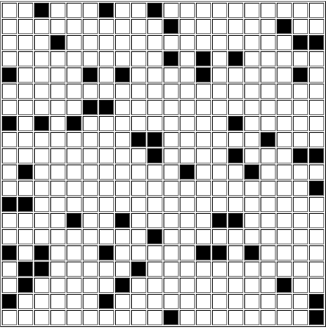

# Game of Life

## Rules

The universe is a two-dimensional orthogonal grid of square cells, each of which is in one of two possible states, `alive` or `dead`.
Every cell interacts with its eight neighbours. At each step in time, the following transitions occur:

- Any live cell with fewer than two live neighbours dies, as if caused by underpopulation.
- Any live cell with two or three live neighbours lives on to the next generation.
- Any live cell with more than three live neighbours dies, as if by overpopulation.
- Any dead cell with exactly three live neighbours becomes a live cell, as if by reproduction.

## Showcase

  

